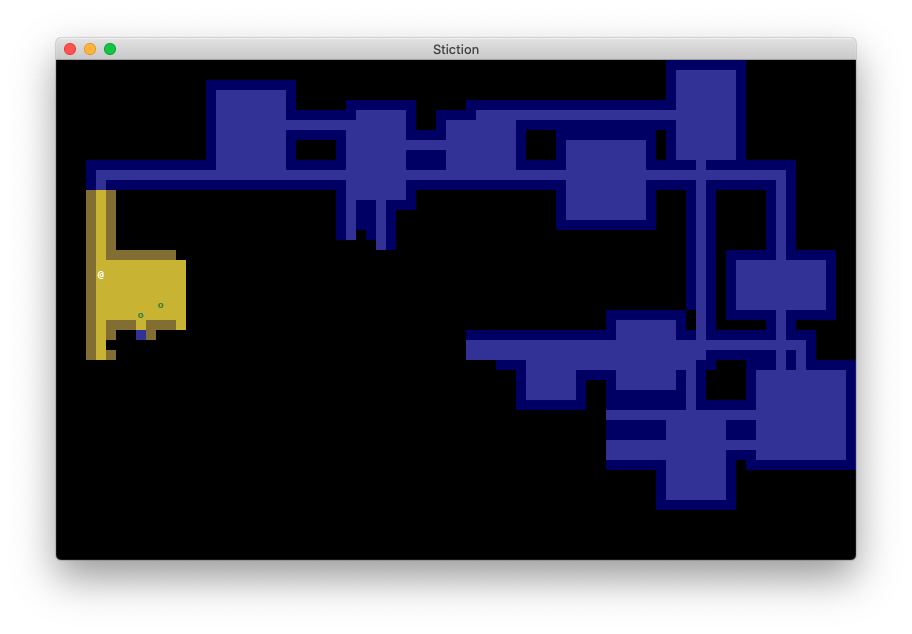

# Stiction

A roguelike RPG game written in Python.



## How To Play

### Download

Download Stiction with git clone or download a ZIP file of Stiction from the repo webpage.

```
git clone https://github.com/vadner/stiction.git
```

### Play

Open the Stiction directory in terminal and enter the following command:

```
python3 main.py
```